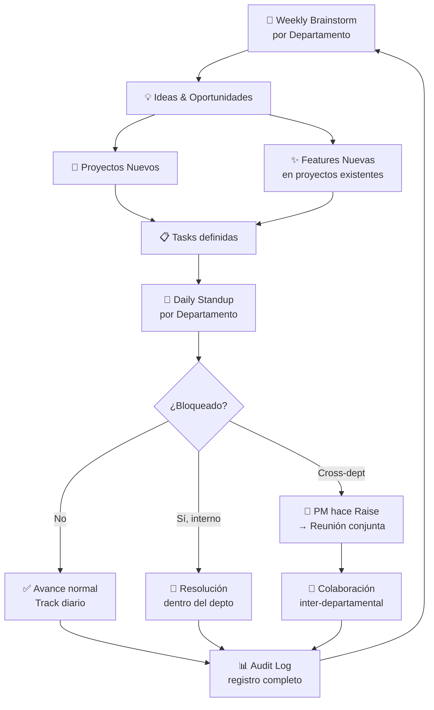
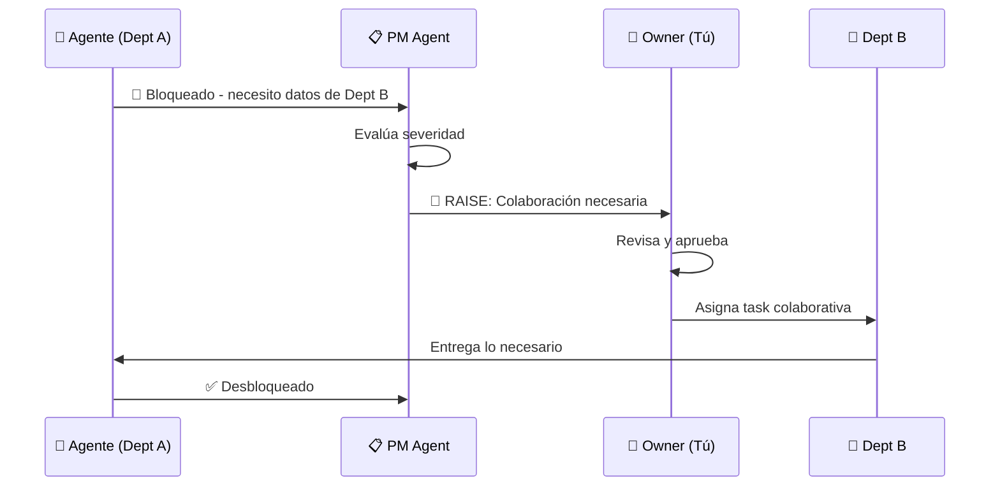

# 🏢 Workspace — Emiralia OS Operating System

## La Visión

Convertir Emiralia en el **sistema operativo de una empresa AI-first**, donde cada departamento tiene agentes autónomos que siguen ritmos de trabajo reales (weeklies, dailys) con trazabilidad completa para auditoría.

---

## 🔄 Flujo Operativo Completo



---

## 📐 Cómo encaja cada pieza

### 1. 📅 Weekly Brainstorm (por Departamento)

| Concepto | Feature en Workspace |
|---|---|
| Reunión semanal de ideación | **Brainstorm Board** — espacio tipo canvas/whiteboard por departamento |
| Participantes | Todos los agentes del departamento + owner (tú) |
| Output | Ideas priorizadas que se convierten en Proyectos o Features |
| Historial | Archivo de todas las weeklies pasadas (auditoría) |

**UI**: Cada departamento tiene un botón "📅 Weekly" que abre un board donde:
- Se listan ideas nuevas (input manual o sugeridas por agentes)
- Se votan/priorizan
- Se convierten en **Proyecto** o **Feature** con un click
- Se archiva automáticamente con timestamp

---

### 2. 📁 Proyectos → Features → Tasks (Pipeline)

```
Weekly Brainstorm
    └── 📁 Proyecto (nuevo o existente)
            └── ✨ Feature
                    └── 📋 Task (asignada a agente)
                            └── 📝 Subtask (opcional)
```

| Nivel | Quién lo crea | Quién lo ejecuta |
|---|---|---|
| **Proyecto** | Weekly brainstorm | PM Agent coordina |
| **Feature** | Weekly brainstorm o agente propone | Departamento owner |
| **Task** | Se descompone del Feature | Agente específico |
| **Subtask** | El propio agente al trabajar | El mismo agente |

**Esto ya lo tienes parcialmente** en tu dashboard actual (projects → phases → tasks). La evolución sería:
- Renombrar "Phases" → "Features" (más intuitivo)
- Añadir el campo `origin` = de qué Weekly salió cada feature/proyecto
- Añadir `assigned_agent` a cada task

---

### 3. 🔁 Daily Standup (Automático por Departamento)

> [!IMPORTANT]
> Este es el **corazón operativo** del Workspace.

Cada departamento tiene un **Daily automático** que muestra:

| Sección | Contenido |
|---|---|
| **✅ Done** | Tasks completadas desde el último daily |
| **🔄 In Progress** | Tasks en curso con % de avance |
| **🚧 Blocked** | Tasks bloqueadas + razón del bloqueo |
| **💡 Opportunities** | Insights/oportunidades detectadas por agentes |
| **📊 Burndown** | Gráfico de progreso del sprint/semana |

**UI**: Vista tipo "standup board" con 3 columnas (Done / WIP / Blocked) + panel lateral de oportunidades.

**Automatización**: Los agentes reportan automáticamente:
- Al completar una task → se mueve a "Done"
- Al detectar un problema → levanta un "Blocker" con contexto
- Al encontrar un dato interesante → registra "Oportunidad"

---

### 4. 🚨 Cross-Department Collaboration (PM Raise)

Cuando un agente en Dept A necesita algo de Dept B:



**Feature**: **Collaboration Requests Panel**
- Lista de todos los "raises" activos
- Prioridad: 🔴 Urgente / 🟡 Normal / 🟢 Nice-to-have
- Estado: Pendiente → Aprobado → En Progreso → Resuelto
- Historial completo para auditoría

---

### 5. 📊 Audit Trail (El Registro Completo)

> [!CAUTION]
> Sin audit trail, no hay forma de hacer retrospectiva ni mejorar procesos.

**Todo queda registrado** en un log inmutable:

| Evento | Datos registrados |
|---|---|
| Weekly creada | Fecha, depto, ideas generadas, decisiones |
| Proyecto creado | Origen (weekly), depto, owner |
| Feature definida | Proyecto padre, descripción, agente asignado |
| Task creada/actualizada | Estado anterior → nuevo, timestamp, agente |
| Daily ejecutado | Resumen, blockers, oportunidades |
| Raise creado | Depto origen, depto destino, motivo, resolución |
| Agente ejecutó run | Input, output, duración, costo, resultado |

**UI**: **Activity Feed** tipo timeline con filtros por:
- Departamento
- Agente
- Tipo de evento
- Rango de fechas
- Proyecto

**Export**: Posibilidad de exportar a CSV/PDF para auditoría formal.

---

## 🗺️ Mapa de Navegación Propuesto

```
Emiralia OS
├── 📊 Dashboard (lo actual — overview de proyectos)
├── 🏢 Workspace (NUEVO)
│   ├── 👁️ Overview
│   │   ├── Org Chart por departamentos
│   │   ├── Health de cada departamento (verde/amarillo/rojo)
│   │   └── Métricas globales (runs, costos, success rate)
│   │
│   ├── 🏬 Departamento (vista individual)
│   │   ├── Agent Cards (agentes del depto)
│   │   ├── 📅 Weekly Board (brainstorm)
│   │   ├── 🔁 Daily Standup (hoy)
│   │   ├── 📋 Backlog (tasks pendientes)
│   │   └── 📈 Métricas del depto
│   │
│   ├── 🤖 Agent Detail
│   │   ├── Profile (skills, tools, config)
│   │   ├── Run History + Logs
│   │   ├── Assigned Tasks
│   │   └── Performance Metrics
│   │
│   ├── 🚨 Collaboration Hub
│   │   ├── Active Raises
│   │   ├── Cross-dept tasks
│   │   └── Meeting notes
│   │
│   └── 📜 Audit Log
│       ├── Full Activity Feed
│       ├── Filtros avanzados
│       └── Export
│
└── ⚙️ Settings
    ├── Agent Config
    ├── Tool Connections (APIs, limits)
    └── Alert Rules
```

---

## 🎯 Fases de Implementación Sugeridas

### Phase 0 — Fundación (Mock Data)
- [ ] Sidebar navigation con "Dashboard" y "Workspace"
- [ ] Workspace Overview con org chart y agent cards (mock)
- [ ] Modelo de datos: Agent, Skill, Tool, Workflow

### Phase 1 — Weekly + Pipeline
- [ ] Weekly Brainstorm Board por departamento
- [ ] Flujo: Idea → Proyecto/Feature → Tasks
- [ ] Vincular tasks a agentes

### Phase 2 — Daily + Tracking
- [ ] Daily Standup automático por departamento
- [ ] Columnas Done/WIP/Blocked
- [ ] Oportunidades detectadas

### Phase 3 — Collaboration + Audit
- [ ] Sistema de Raises (PM → Owner)
- [ ] Collaboration Hub
- [ ] Audit Log completo con timeline
- [ ] Export para auditoría

### Phase 4 — Intelligence
- [ ] Métricas y analytics avanzados
- [ ] Cost tracking por agente/tool
- [ ] Alertas configurables
- [ ] Forecasting
